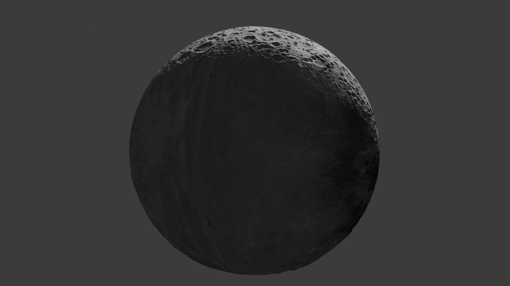
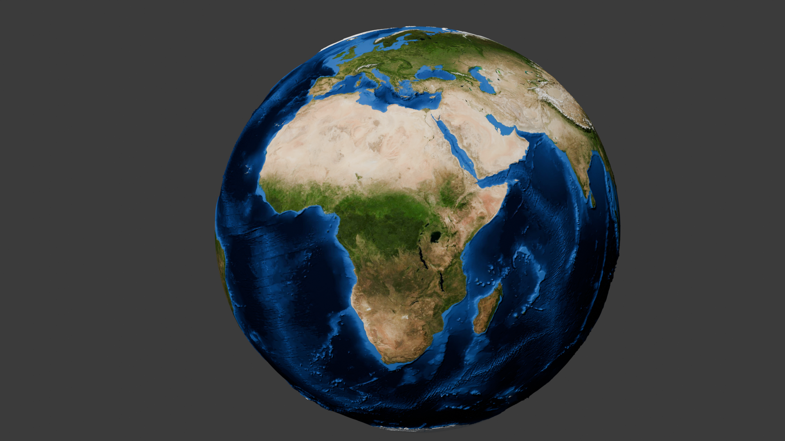

# blender - topological earth

## 01 - introduction

## 02 - create a plane
- scale x: 360 (around equator)
- scale y: 180 (around poles)
- fix clipping: menu (n) -> view -> clipping -> end: 10000m

## 03 - add subdivision modifier
- subdivision -> simple
- subdivisions: viewport 6, render 2
- wireframe shading mode

## 04 - add displacement modifier
- add modifier -> deform -> displace modifier
- texture -> new texture -> show texture in texture tab -> 
- texture tab -> image -> open asset -> ./04-shuttle-radar-topography-missions-ramp2.world.5400x2700.jpg
- back at modifier -> set strength

## 05 - add second subdivision surface modifier
- add another subdivision surface modifier
- move it above the displacement modifier

## 06 - simple deform modifier
- change shape into sphere
- front view -> rotate: x 90
- add modifier -> simple deform -> need to set axis origin
- move cursor: shift + s -> cursor to grid
- note: ensure empty is at 0,0,0 for x,y,z
- create an empty: shift + a -> empty -> plain axes
- on the simple deform -> set axis (x) 
- set origin -> empty
- simple deform -> select "bend" 
-> set angle 180
- FIX: need to fix the displacement texture -> image -> settings -> mapping -> "extend" (was "repeat")

## 07 - second simple deform modifier
- add another simple deform
- move cursor: shift + s -> cursor to grid
- add another empty
- note: ensure empty is at 0,0,0 for x,y,z
- on the second simple deform -> set origin by select the new (second) empty created
- axis -> z
- angle 360

## 08 applying texture
- add new material -> base color (dot button) -> image texture -> ./assets/worldColor.jpg
- object -> shade smooth
- resize mountain heights -> displace modifier -> size 10

## 09 Experiment with Renderer Colours and ApplyUndo Modifiers
- Specular reflection occurs when light rays bounce off a smooth surface at a specific angle. 
- with plane selected -> material properties -> specular (remove) -> becomes less reflective shiny
- thing with applying modifiers is you can then play with vertices BUT if you dont need to mod, then you should leave modifiers un-applied

## 10 exporting / sharing the model 
- you can share an export of the model 
- export -> wavefront .obj 
- make sure apply modifiers is selected
- it exports a single object with the modifiers applied
- when you import this model, it will be a single object and wont have any modifiers attached

## 11 using-the-uv-editor-to-add-a-moon-texture
- create a new material -> color (round button next to color) -> image texture -> add ./assets/moon-texture.jpg
- edit mode -> select the plane -> 3d viewport top menu
- then in uv editor (it will show the bounds of the plane)
- in material editor -> assign -> moon
- the idea is that you only need to create a new material then with the uv editor select all and in the material editor assign the moon texture

## 12 moon-heightmap
- update displacement map for moon (texture properties) -> load moon heightmap -> refresh button 

## 13 Ocean data - Adding GEBCO Bathymetry Information
- data for the oceans (https://www.gebco.net/data_and_products/gridded_bathymetry_data/)
- NOTE: gebco info maps also include elevation data
- The GEBCO (*General Bathymetric Chart of the Oceans) is a publicly available bathymetric chart of the world's oceans
- can also Download data for user-defined areas - Use their application to select and download data in netCDF, Esri ASCII raster and data GeoTiff formats.
- https://sbcode.net/topoearth/

downloadable:
Blue Marble 5400x2700 (https://sbcode.net/topoearth/blue-marble-texture-5400x2700/)
Blue Marble 10800x5400
Blue Marble 21600x10800
Blue Marble 86400x43200
SRTM Heightmap 5400x2700 (https://sbcode.net/topoearth/srtm-heightmap/)
Gebco Heightmap 5400x2700 (https://sbcode.net/topoearth/gebco-heightmap-5400x2700/)
(./assets/gebco_bathy.5400x2700_8bit.jpg)
(./assets/gebco_bathy.5400x2700_16bit.tif)

Gebco Heightmap 10800x5400
Gebco Heightmap 21600x10800
Moon Texture
Moon Heightmap

- NOTE: 8bit Gebco Heightmap (.jpg) vs 16bit Gebco Heightmap (.tif) 
- modifiers -> displace -> texture -> new texture -> image (the first input on interface) -> pick file -> 8bit gebco
- 8bit means all height info have 256 possible values
- explained highest point eg 8000m lowest point 8000m -> height difference 16000m and you only have 256 values to represent this meaning 1 value represents 16000/256 = 62.5meter
- 16bit means 65536 possible values = 16000 / 65536 = 0.24meters per value

#### saving 16bit color images
- note: when saving, make sure to select 16bit-color depth if the image source is 16bit
- in modifiers -> the second subdivision modifier -> update levels to 6 for viewport and render

#### observations
- visually inspecting an 8bit image source render vs 16bit image source render of the earth - there is not much difference except for 8x file size of the 16bit render

##### 8bit render

##### 16bit render
