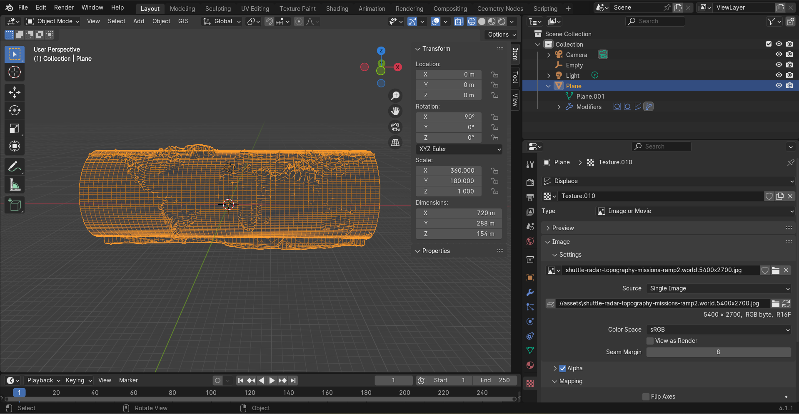
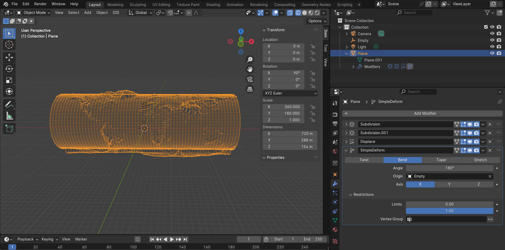
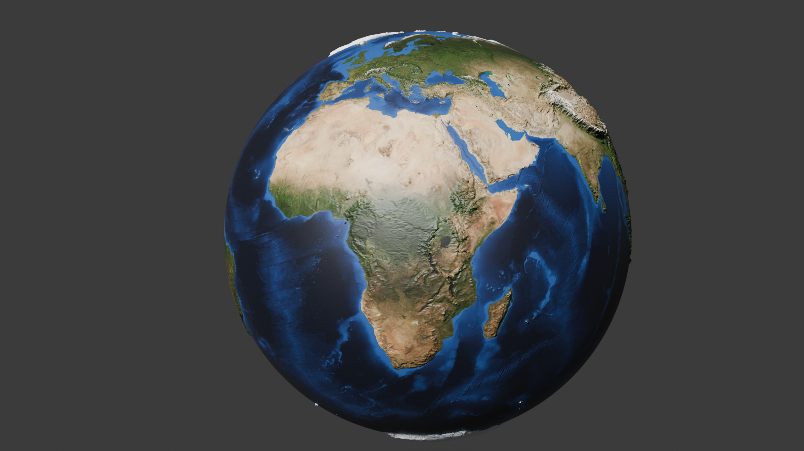
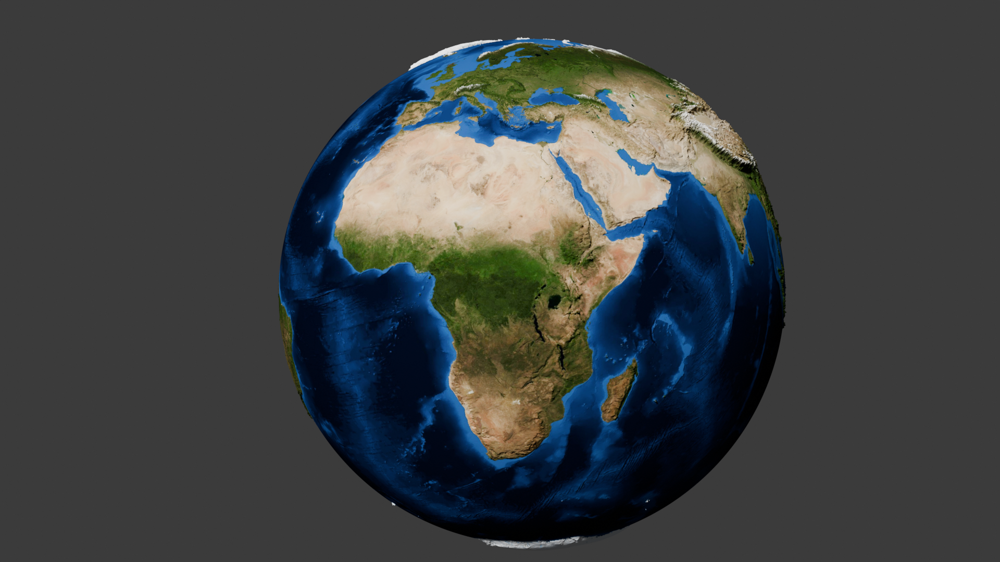

# blender - topological earth

## 01 - introduction

## 02 - create a plane
- scale x: 360 (around equator)
- scale y: 180 (around poles)
- fix clipping: menu (n) -> view -> clipping -> end: 10000m

## 03 - add subdivision modifier
- subdivision -> simple
- subdivisions: viewport 6, render 2
- wireframe shading mode

## 04 - add displacement modifier
- add modifier -> deform -> displace modifier
- texture -> new texture -> show texture in texture tab -> 
- texture tab -> image -> open asset -> ./04-shuttle-radar-topography-missions-ramp2.world.5400x2700.jpg
- back at modifier -> set strength

## 05 - add second subdivision surface modifier
- add another subdivision surface modifier
- move it above the displacement modifier

## 06 - simple deform modifier
- change shape into sphere
- front view -> rotate: x 90
- add modifier -> simple deform -> need to set axis origin
- move cursor: shift + s -> cursor to grid
- note: ensure empty is at 0,0,0 for x,y,z
- create an empty: shift + a -> empty -> plain axes
- on the simple deform -> set axis (x) 
- set origin -> empty
- simple deform -> select "bend" 
-> set angle 180
- FIX: need to fix the displacement texture -> image -> settings -> mapping -> "extend" (was "repeat")

## 07 - second simple deform modifier
- add another simple deform
- move cursor: shift + s -> cursor to grid
- add another empty
- note: ensure empty is at 0,0,0 for x,y,z
- on the second simple deform -> set origin by select the new (second) empty created
- axis -> z
- angle 360

## 08 applying texture
- add new material -> base color (dot button) -> image texture -> ./assets/worldColor.jpg
- object -> shade smooth
- resize mountain heights -> displace modifier -> size 10

## 09 Experiment with Renderer Colours and ApplyUndo Modifiers
- Specular reflection occurs when light rays bounce off a smooth surface at a specific angle. 
- with plane selected -> material properties -> specular (remove) -> becomes less reflective shiny
- thing with applying modifiers is you can then play with vertices BUT if you dont need to mod, then you should leave modifiers un-applied

