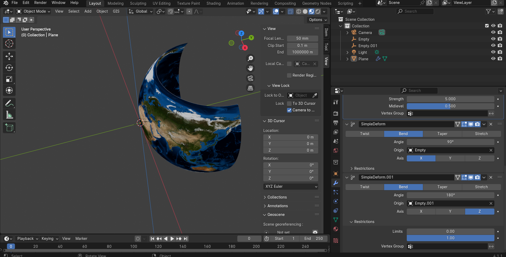
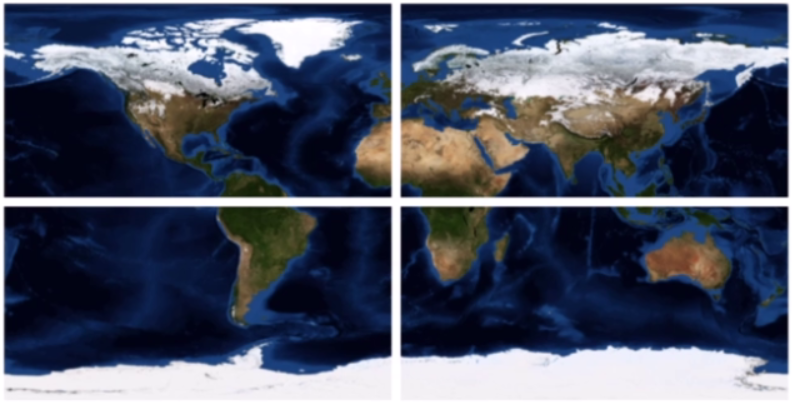

# blender - topological earth

## 01 - introduction

## 02 - create a plane
- scale x: 360 (around equator)
- scale y: 180 (around poles)
- fix clipping: menu (n) -> view -> clipping -> end: 10000m

## 03 - add subdivision modifier
- subdivision -> simple
- subdivisions: viewport 6, render 2
- wireframe shading mode

## 04 - add displacement modifier
- add modifier -> deform -> displace modifier
- texture -> new texture -> show texture in texture tab -> 
- texture tab -> image -> open asset -> ./04-shuttle-radar-topography-missions-ramp2.world.5400x2700.jpg
- back at modifier -> set strength

## 05 - add second subdivision surface modifier
- add another subdivision surface modifier
- move it above the displacement modifier

## 06 - simple deform modifier
- change shape into sphere
- front view -> rotate: x 90
- add modifier -> simple deform -> need to set axis origin
- move cursor: shift + s -> cursor to grid
- note: ensure empty is at 0,0,0 for x,y,z
- create an empty: shift + a -> empty -> plain axes
- on the simple deform -> set axis (x) 
- set origin -> empty
- simple deform -> select "bend" 
-> set angle 180
- FIX: need to fix the displacement texture -> image -> settings -> mapping -> "extend" (was "repeat")

## 07 - second simple deform modifier
- add another simple deform
- move cursor: shift + s -> cursor to grid
- add another empty
- note: ensure empty is at 0,0,0 for x,y,z
- on the second simple deform -> set origin by select the new (second) empty created
- axis -> z
- angle 360

## 08 applying texture
- add new material -> base color (dot button) -> image texture -> ./assets/worldColor.jpg
- object -> shade smooth
- resize mountain heights -> displace modifier -> size 10

## 09 Experiment with Renderer Colours and ApplyUndo Modifiers
- Specular reflection occurs when light rays bounce off a smooth surface at a specific angle. 
- with plane selected -> material properties -> specular (remove) -> becomes less reflective shiny
- thing with applying modifiers is you can then play with vertices BUT if you dont need to mod, then you should leave modifiers un-applied

## 10 exporting / sharing the model 
- you can share an export of the model 
- export -> wavefront .obj 
- make sure apply modifiers is selected
- it exports a single object with the modifiers applied
- when you import this model, it will be a single object and wont have any modifiers attached

## 11 using-the-uv-editor-to-add-a-moon-texture
- create a new material -> color (round button next to color) -> image texture -> add ./assets/moon-texture.jpg
- edit mode -> select the plane -> 3d viewport top menu
- then in uv editor (it will show the bounds of the plane)
- in material editor -> assign -> moon
- the idea is that you only need to create a new material then with the uv editor select all and in the material editor assign the moon texture

## 12 moon-heightmap
- update displacement map for moon (texture properties) -> load moon heightmap -> refresh button 

## 13 Ocean data - Adding GEBCO Bathymetry Information
- data for the oceans (https://www.gebco.net/data_and_products/gridded_bathymetry_data/)
- NOTE: gebco info maps also include elevation data
- The GEBCO (*General Bathymetric Chart of the Oceans) is a publicly available bathymetric chart of the world's oceans
- can also Download data for user-defined areas - Use their application to select and download data in netCDF, Esri ASCII raster and data GeoTiff formats.

- NOTE: 8bit Gebco Heightmap (.jpg) vs 16bit Gebco Heightmap (.tif) 
- modifiers -> displace -> texture -> new texture -> image (the first input on interface) -> pick file -> 8bit gebco
- 8bit means all height info have 256 possible values
- explained highest point eg 8000m lowest point 8000m -> height difference 16000m and you only have 256 values to represent this meaning 1 value represents 16000/256 = 62.5meter
- 16bit means 65536 possible values = 16000 / 65536 = 0.24meters per value

- https://sbcode.net/topoearth/

#### material (image texture) vs displace modifier (displacement texture)
- so the one (blue marble) is material (color) -> select the plane
- and other is height map (Gebco Heightmap) -> select the displace modifier

downloadable:
- Blue Marble 5400x2700 (https://sbcode.net/topoearth/blue-marble-texture-5400x2700/)
- Blue Marble 10800x5400 (https://sbcode.net/topoearth/blue-marble-texture-10800x5400/)
    - Top Left image: -180.90.0.0 (top left -180 90 -> bottom right 0 0)  
    - Top Right image: 0.90.180.0 (top left 0 90 -> bottom right 180 0)  
    - Bottom Left image: -180.0.0.-90 (top left -180 0 -> bottom right 0 -90)  
    - Bottom Right image: 0.0.180.-90 (top left 0 0 -> bottom right 180 -90)  

- Blue Marble 21600x10800
- Blue Marble 86400x43200
    - 256 x JPG Images of 5400x2700 totaling 86400x43200
    - 16 rows (0 based) / 16 cols (0 based)
    - https://sbcode.net/topoearth/downloads/world.topo.bathy_15s_5400x2700_(row)_(col).jpg
    - top-left: https://sbcode.net/topoearth/downloads/world.topo.bathy_15s_5400x2700_0_0.jpg
    - bottom-right: https://sbcode.net/topoearth/downloads/world.topo.bathy_15s_5400x2700_15_15.jpg
    - Attribution: Tiles based on NASA Visible Earth : https://visibleearth.nasa.gov/collection/1484/blue-marble and preprocessed by Sean Bradley :https://sbcode.net/topoearth/blue-marble-texture-86400x43200/#license

transforms could possibly look like:
0_0     -337.5, 0, 168.75     90, 0, 0     90, 22.5, 1  
0_1     -270, 0, 168.75       90, 0, 0     90, 22.5, 1  
0_2     -202.5, 0, 168.75     90, 0, 0     90, 22.5, 1  
...     ...                    ...          ...        ...  
0_15    270, 0, 168.75        90, 0, 0     90, 22.5, 1  

1_0     -337.5, 0, 112.5      90, 0, 0     90, 22.5, 1  
1_1     -270, 0, 112.5        90, 0, 0     90, 22.5, 1  
1_2     -202.5, 0, 112.5      90, 0, 0     90, 22.5, 1  
...     ...                    ...          ...        ...  
1_15    270, 0, 112.5         90, 0, 0     90, 22.5, 1  

...     ...                    ...          ...        ...  

15_0    -337.5, 0, -168.75    90, 0, 0     90, 22.5, 1  
15_1    -270, 0, -168.75      90, 0, 0     90, 22.5, 1  
15_2    -202.5, 0, -168.75    90, 0, 0     90, 22.5, 1  
...     ...                    ...          ...        ...  
15_15   270, 0, -168.75       90, 0, 0     90, 22.5, 1  

- SRTM Heightmap 5400x2700 (https://sbcode.net/topoearth/srtm-heightmap/)
- Gebco Heightmap 5400x2700 (https://sbcode.net/topoearth/gebco-heightmap-5400x2700/)
    - (./assets/gebco_bathy.5400x2700_8bit.jpg)
    - (./assets/gebco_bathy.5400x2700_16bit.tif)

- Gebco Heightmap 10800x5400 (https://sbcode.net/topoearth/gebco-heightmap-10800x5400/)
    - 4 x 16bit TIFF Images of 5400x2700 totaling 10800x5400
    - Attribution: Heightmaps based on GEBCO 2020 Grid and preprocessed by Sean Bradley : https://sbcode.net/topoearth/gebco-heightmap-10800x5400/#license
    - Top Left image: -180.90.0.0 (top left -180 90 -> bottom right 0 0)  
    - Top Right image: 0.90.180.0 (top left 0 90 -> bottom right 180 0)  
    - Bottom Left image: -180.0.0.-90 (top left -180 0 -> bottom right 0 -90)  
    - Bottom Right image: 0.0.180.-90 (top left 0 0 -> bottom right 180 -90)  

    - transforms:
    Tile Locations | (X,Y,Z) | Rotation (X,Y,Z) | Scale (X,Y,Z):  
    Tile Top Left | 0, 0, 90 | 90, 0, 0 | 180, 90, 1  
    Top Right | 360, 0, 90 | 90, 0, 0 | 180, 90, 1  
    Bottom Left | 0, 0, -90	| 90, 0, 0	| 180, 90, 1  
    Bottom Right | 360, 0, -90 | 90, 0, 0 | 180, 90, 1  

    - Modifiers
    Modifier	Property	Value  
    SimpleDeform	Angle	90°  
    SimpleDeform.001	Angle	180°  

- Gebco Heightmap 21600x10800 (https://sbcode.net/topoearth/gebco-heightmap-21600x10800/)
    - 16 x 16bit TIFF Images of 5400x2700 totaling 21600x10800
    - Attribution: Heightmaps based on GEBCO 2020 Grid and preprocessed by Sean Bradley : https://sbcode.net/topoearth/gebco-heightmap-21600x10800/#license

    - Transforms
    Tile	Locations (X,Y,Z)	Rotation (X,Y,Z)	Scale (X,Y,Z)  
    0_0	(-270, 0, 135)	(90, 0, 0)	(90, 45, 1)  
    0_1	(-90, 0, 135)	(90, 0, 0)	(90, 45, 1)  
    0_2	(90, 0, 135)	(90, 0, 0)	(90, 45, 1)  
    0_3	(270, 0, 135)	(90, 0, 0)	(90, 45, 1)  
    1_0	(-270, 0, 45)	(90, 0, 0)	(90, 45, 1)  
    1_1	(-90, 0, 45)	(90, 0, 0)	(90, 45, 1)  
    1_2	(90, 0, 45)	    (90, 0, 0)	(90, 45, 1)  
    1_3	(270, 0, 45)	(90, 0, 0)	(90, 45, 1)  
    2_0	(-270, 0, -45)	(90, 0, 0)	(90, 45, 1)  
    2_1	(-90, 0, -45)	(90, 0, 0)	(90, 45, 1)  
    2_2	(90, 0, -45)	(90, 0, 0)	(90, 45, 1)  
    2_3	(270, 0, -45)	(90, 0, 0)	(90, 45, 1)  
    3_0	(-270, 0, -135)	(90, 0, 0)	(90, 45, 1)  
    3_1	(-90, 0, -135)	(90, 0, 0)	(90, 45, 1)  
    3_2	(90, 0, -135)	(90, 0, 0)	(90, 45, 1)  
    3_3	(270, 0, -135)	(90, 0, 0)	(90, 45, 1)  

    - Modifier	Property	Value  
    SimpleDeform	Angle	45°  
    SimpleDeform.001	Angle	90°  

- Moon Texture
- Moon Heightmap

#### saving 16bit color images
- note: when saving, make sure to select 16bit-color depth if the image source is 16bit
- in modifiers -> the second subdivision modifier -> update levels to 6 for viewport and render

#### observations
- visually inspecting an 8bit image source render vs 16bit image source render of the earth - there is not much difference except for 8x file size of the 16bit render

##### 8bit render

##### 16bit render

## 14 Using Higher Resolution Textures and Heightmaps 
- you could add a third subdivision modifier - but your computer will be working exponentially harder
- instead you can opt to use higher resolution images
- 5400x2700 resolution images equates to each pixel representing 7 square km
- BUT you can subdivide a 10800 x 5400 resolution image into 4 images (top-left, top-right, bottom-left, bottom-right) -> each pixel represents 3.7 square km 
- TODO: 2nd subdivision surface modifier -> reduce viewport to 3
- edit mode -> reduce scale (earth in viewport becomes smaller) to x: 180, y: 90 -> we arent creating a whole sphere but 1 quarter
- the simple deforms need to be edited:

#### creating sphere quarters
1st simple deform: was 180 -> half it (change to 90)
2nd simple deform: was 360 -> half it (change to 180)

#### now use the 10800 x 5400 texture
- NOTE: computer struggles to render 3x 5400 x 2700 image mesh even in eevee

- 4x jpg images of 5400 x 2700 = totalling 10800 x 5400 texture (see "13 Ocean data" for coordinates)
- see (13 Ocean data - Adding GEBCO Bathymetry Information) for download links
- the blue marble links are the material color
- the gebco links are height maps (displace modifier)

#### image coordinates
- Top Left image: -180.90.0.0 (top left -180 90 -> bottom right 0 0)  
- Top Right image: 0.90.180.0 (top left 0 90 -> bottom right 180 0)  
- Bottom Left image: -180.0.0.-90 (top left -180 0 -> bottom right 0 -90)  
- Bottom Right image: 0.0.180.-90 (top left 0 0 -> bottom right 180 -90)  

### TOP-LEFT render
- note the steps below should be repeated for top-right, bottom-left, bottom-right
- should you want a flat render, you do not need the 2x simple deform modifiers

#### materials and height maps 
- todo: eg. top-left image -> select plane -> material properties -> update image -> world.topo.bathy.5400x2700_-180.90.0.0.jpg
- todo: do the same for heightmaps using gebco data images -> modifiers -> displace -> texture -> gebco_bathy.5400x2700_16bit_-180.90.0.0.tif

- TODO: do the same for top-right, bottom-left, bottom-right

- if you are duplicating the object (object view mode): you need to create a new material -> load the image
- then go into edit mode for the new duplicate -> assign the new material
- set tile location positions in object mode
- do the same for the height maps

### transforms
- transformations: Tile Locations | (X,Y,Z) | Rotation (X,Y,Z) | Scale (X,Y,Z):  
    - Top Left | 0, 0, 90 | 90, 0, 0 | 180, 90, 1  
    - Top Right | 360, 0, 90 | 90, 0, 0 | 180, 90, 1  
    - Bottom Left | 0, 0, -90	| 90, 0, 0	| 180, 90, 1  
    - Bottom Right | 360, 0, -90 | 90, 0, 0 | 180, 90, 1  

## 15 Using 1 Pixel per Minute Textures and Zooming with the UV Editor
- still referencing 2x empty objects (positioned 0,0,0)
- and applying transforms
- applying modifiers repeat for each segment to be rendered

#### zooming in using UV Editor
- can turn off both simple deform modifiers applied -> results in flat image
